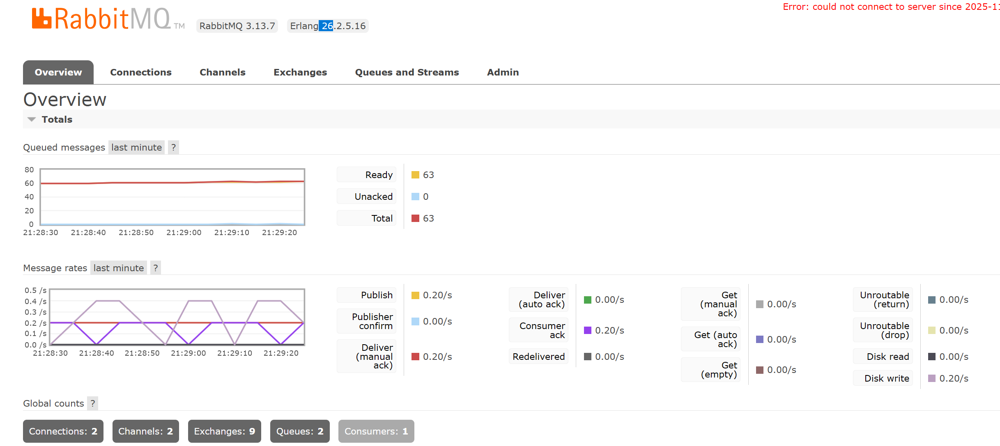

# HW 6 RabbitMQ

## Structure

- `consumer.py ` - обрабротчик      
- `producer.py` - отправитель     

## How to starts

```docker compose build -up ```

## RabbitMQ Dashboard       
http://localhost:15672/#/

## How it works 

